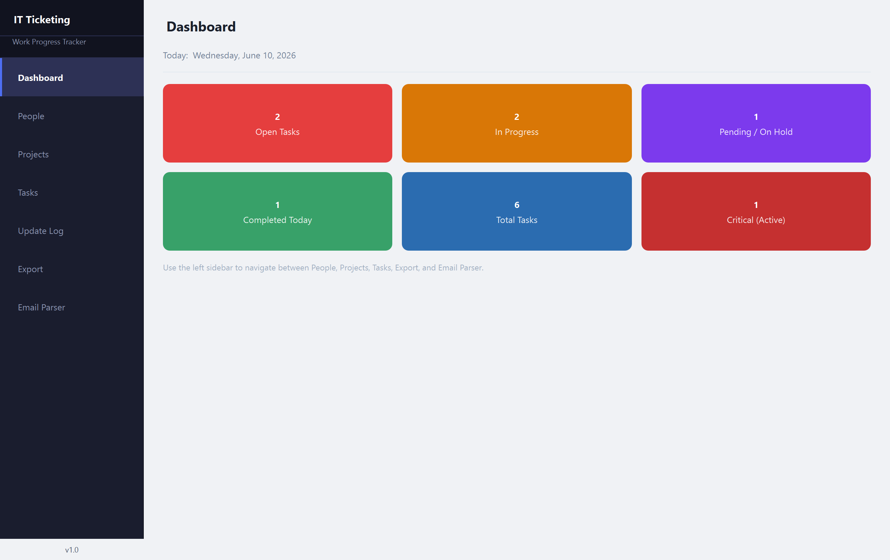
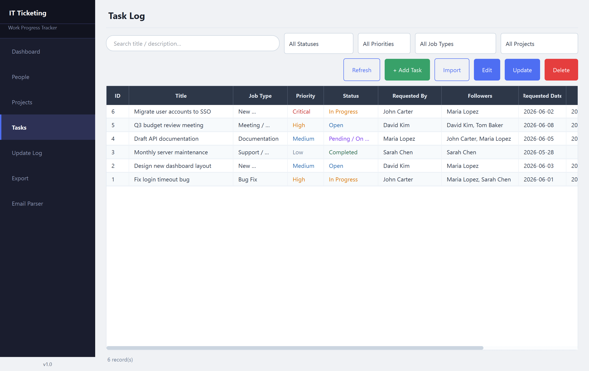
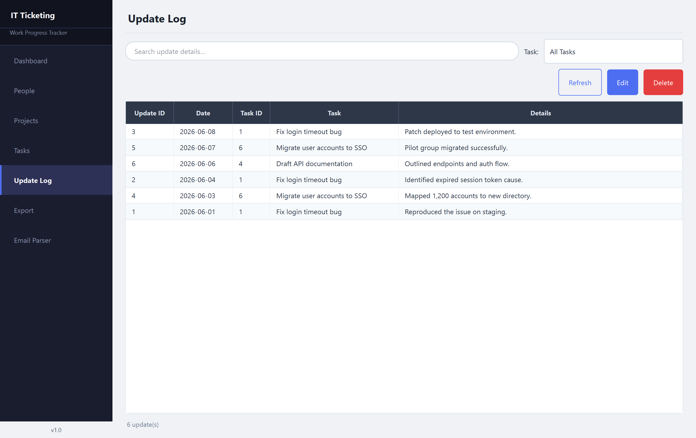
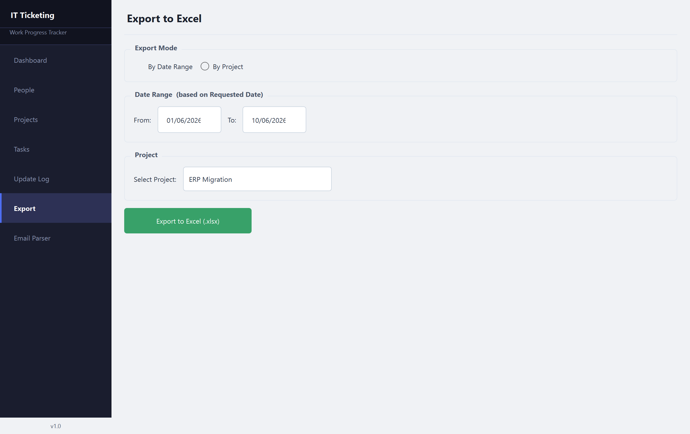
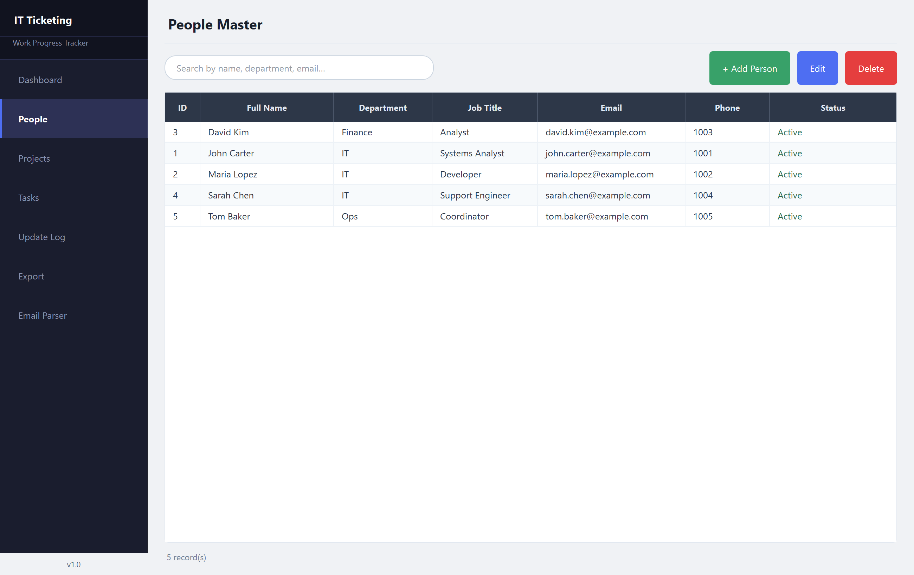
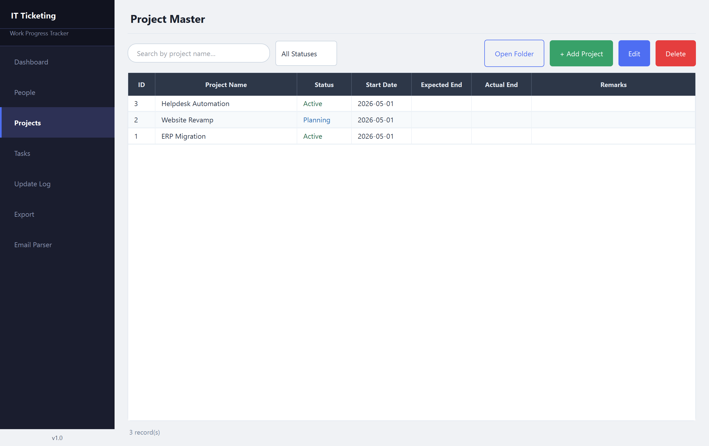

# IT Ticketing System

A Windows desktop application for tracking daily IT work progress, built with
PyQt6, Python, MySQL, and the Anthropic Claude API.

---

## Features

| Module | Description |
|---|---|
| **Dashboard** | Live summary cards – Open, In Progress, Pending, Completed Today, Total, Critical |
| **People Master** | Add / Edit / Delete team members; link to tasks |
| **Project Master** | Manage large projects with status, dates, folder path |
| **Task Log** | Full-featured task tracker with filters by status, priority, job type, project. Each task can be handled by multiple teammates (Followers) and tracked with dated progress updates |
| **Update Log** | Master list of every dated task update; filter by task or search the details |
| **Excel Export** | Export tasks to formatted `.xlsx` by date range or by project. The Progress column shows each task's updates in chronological order |
| **Email Parser** | Paste an email → Claude AI extracts fields → one-click task creation |

---

## Screenshots

> Screenshots use sample/demo data — they do not show any real records.

### Dashboard
Live summary cards at a glance.



### Task Log
Filterable task tracker with multi-teammate **Followers**, colour-coded priority/status,
click-to-sort columns, Excel **Import**, and per-task **Update**.



### Update Log
Every dated task update in one place, filterable by task.



### Excel Export
Export by date range or project, with progress shown chronologically.



<details>
<summary>More screenshots — People &amp; Projects</summary>

### People Master


### Project Master


</details>

---

## Prerequisites

| Requirement | Version |
|---|---|
| Python | 3.10 or newer (3.11 recommended) |
| MySQL Server | 8.0 or newer (community edition is fine) |
| pip | (bundled with Python) |

---

## Step-by-Step Setup (Windows)

### 1 — Install MySQL

1. Download **MySQL Community Server** from https://dev.mysql.com/downloads/mysql/
2. Run the installer, choose **Developer Default** or **Server only**.
3. During setup, set a **root password** and note it down.
4. Make sure the MySQL service is set to start automatically.

> Alternatively, install **XAMPP** or **WAMP** if you already have one of those.

---

### 2 — Clone / Download the project

```
git clone <repo-url>
```

or unzip the project folder to a convenient location such as:

```
C:\Projects\Ticketing_System\
```

---

### 3 — Create a Python virtual environment (recommended)

Open **Command Prompt** inside the project folder and run:

```bat
python -m venv venv
venv\Scripts\activate
```

---

### 4 — Install Python dependencies

```bat
pip install -r requirements.txt
```

This installs:

| Package | Purpose |
|---|---|
| `PyQt6` | Desktop GUI framework |
| `mysql-connector-python` | MySQL database driver |
| `python-dotenv` | Load settings from `.env` |
| `openpyxl` | Excel export |
| `anthropic` | Claude AI API client |

---

### 5 — Configure the `.env` file

Copy the example file and fill in your values:

```bat
copy .env.example .env
```

Open `.env` in Notepad and set:

```ini
# MySQL credentials
DB_HOST=localhost
DB_PORT=3306
DB_USER=root
DB_PASSWORD=your_mysql_root_password

# The app will create this database automatically on first run
DB_NAME=ticketing_system

# Get your API key at https://console.anthropic.com/
ANTHROPIC_API_KEY=sk-ant-...

# Claude model used for email parsing (optional – defaults shown)
CLAUDE_MODEL=claude-sonnet-4-5-20250514
```

> **Security note:** Never commit your `.env` file to version control.
> The `.env.example` (with placeholder values) is safe to commit.

---

### 6 — Run the application

```bat
python main.py
```

On **first launch**, the app will automatically:
- Connect to MySQL
- Create the `ticketing_system` database (if it does not exist)
- Create the three tables: `people`, `projects`, `tasks`

---

## Usage Guide

### Navigation

The left sidebar contains seven sections. Click any item to switch pages.

### People Master

1. Click **+ Add Person** to create a new person.
2. Fill in Full Name (required), Department, Job Title, Email, Phone, and Status.
3. Double-click any row to edit.
4. Select a row and click **Delete** to remove (confirmation required).
5. Use the search bar to filter by name, department, or email.

### Project Master

1. Click **+ Add Project** to create a project.
2. Optional dates use the **Set** checkbox to enable the date picker.
3. Use **Browse…** to pick the project folder path.
4. Select a project row and click **Open Folder** to open it in Windows Explorer.

### Task Log

1. Click **+ Add Task** to log a new task.
2. Use the four filter dropdowns (Status, Priority, Job Type, Project) and the
   search bar to narrow the list.
3. Double-click a row to edit a task.
4. In the task dialog, tick one or more people under **Followers** to assign the
   task to multiple teammates.
5. Priority and Status columns are colour-coded for quick scanning.

### Adding a Task Update

1. Select a task in the list and click **Update**.
2. The **Update Date** defaults to today — change it if needed.
3. Type the **Update Details** and click **Save**. The update is stored against
   that task and appears in the Update Log and the export's Progress column.

### Update Log

1. Open **Update Log** from the sidebar to see every update across all tasks
   (newest first).
2. Use the **Task** dropdown to show only one task's updates, or the search bar
   to find text in the details.
3. Select a row and click **Edit** or **Delete** to manage an update.

### Excel Export

1. Choose **By Date Range** or **By Project**.
2. Set the date range or select the project.
3. Click **Export to Excel** — you will be prompted to choose a save location.
4. The generated file includes a title row, auto-width columns, alternating row
   colours, and auto-filter headers.

### Email Parser (AI)

1. Copy and paste the full email text (headers + body) into the text area.
2. Click **Parse with AI** — Claude analyses the email in the background.
3. Review and edit the pre-filled fields (Title, Description, Requested By, Date,
   Priority, Job Type).
4. Click **Create Task →** — the Task dialog opens with the fields pre-filled.
5. Complete any remaining fields (Status, Follow-up By, Project…) and click **Save**.

---

## Project Structure

```
Ticketing_System/
├── main.py                  # Entry point – main window + sidebar
├── requirements.txt
├── .env.example             # Configuration template
├── .env                     # Your local config (not committed)
│
├── database/
│   └── db_manager.py        # MySQL connection, table creation, helper queries
│
├── modules/
│   ├── dashboard.py         # Summary stat cards
│   ├── people.py            # People Master CRUD
│   ├── projects.py          # Project Master CRUD
│   ├── tasks.py             # Task Log CRUD (core module)
│   ├── export.py            # Excel export (openpyxl)
│   └── email_parser.py      # Claude AI email-to-task parser
│
└── assets/
    └── styles.qss           # Qt stylesheet (dark sidebar + clean light content)
```

---

## Troubleshooting

| Problem | Solution |
|---|---|
| `Database Connection Error` on launch | Check `DB_HOST`, `DB_USER`, `DB_PASSWORD` in `.env`. Make sure MySQL is running. |
| `anthropic package not installed` | Run `pip install anthropic` |
| `ANTHROPIC_API_KEY is not set` | Add your key to `.env` |
| `openpyxl not installed` | Run `pip install openpyxl` |
| Tables not created / missing columns | Delete the `ticketing_system` database in MySQL and relaunch — the app recreates everything. |
| App looks blurry on high-DPI screen | Add `app.setAttribute(Qt.ApplicationAttribute.AA_EnableHighDpiScaling)` before `app.exec()` in `main.py` |

---

## Database Schema

### `people`
| Column | Type | Notes |
|---|---|---|
| person_id | INT AUTO_INCREMENT | PK |
| full_name | VARCHAR(100) | Required |
| department | VARCHAR(100) | |
| job_title | VARCHAR(100) | |
| email | VARCHAR(150) | |
| phone | VARCHAR(50) | |
| is_active | TINYINT(1) | 1 = Active |

### `projects`
| Column | Type | Notes |
|---|---|---|
| project_id | INT AUTO_INCREMENT | PK |
| project_name | VARCHAR(200) | Required |
| project_description | TEXT | |
| business_requirements | TEXT | |
| start_date | DATE | |
| expected_end_date | DATE | |
| actual_end_date | DATE | |
| status | VARCHAR(20) | Planning / Active / On Hold / Completed / Cancelled |
| folder_path | VARCHAR(500) | Windows folder path |
| remarks | TEXT | |

### `tasks`
| Column | Type | Notes |
|---|---|---|
| task_id | INT AUTO_INCREMENT | PK |
| task_title | VARCHAR(300) | Required |
| task_description | TEXT | |
| job_type | VARCHAR(60) | See dropdown options |
| priority | VARCHAR(20) | Low / Medium / High / Critical |
| status | VARCHAR(30) | Open / In Progress / Pending… / Completed / Cancelled / Closed |
| requested_by | INT | FK → people |
| follow_up_by | INT | FK → people — legacy "primary follower" (kept in sync with the first follower) |
| requested_date | DATE | |
| due_date | DATE | |
| linked_project | INT | FK → projects |
| current_progress | TEXT | |
| remarks | TEXT | |

### `task_followers`

A task can be handled by **multiple** teammates. This junction table stores the
many-to-many link between tasks and people (the "Followers" multi-select in the
Task dialog).

| Column | Type | Notes |
|---|---|---|
| task_id | INT | PK (composite), FK → tasks, `ON DELETE CASCADE` |
| person_id | INT | PK (composite), FK → people, `ON DELETE CASCADE` |

### `task_updates`

A dated log of progress updates for each task (one task → many updates). Surfaced
in the **Update Log** page and aggregated into the export's **Progress** column.

| Column | Type | Notes |
|---|---|---|
| update_id | INT AUTO_INCREMENT | PK |
| task_id | INT | FK → tasks, `ON DELETE CASCADE` |
| update_date | DATE | Defaults to today in the dialog; user-editable |
| update_details | TEXT | The progress note |
| created_at | TIMESTAMP | Auto |

---

## License

MIT — free to use and modify for personal or commercial projects.
